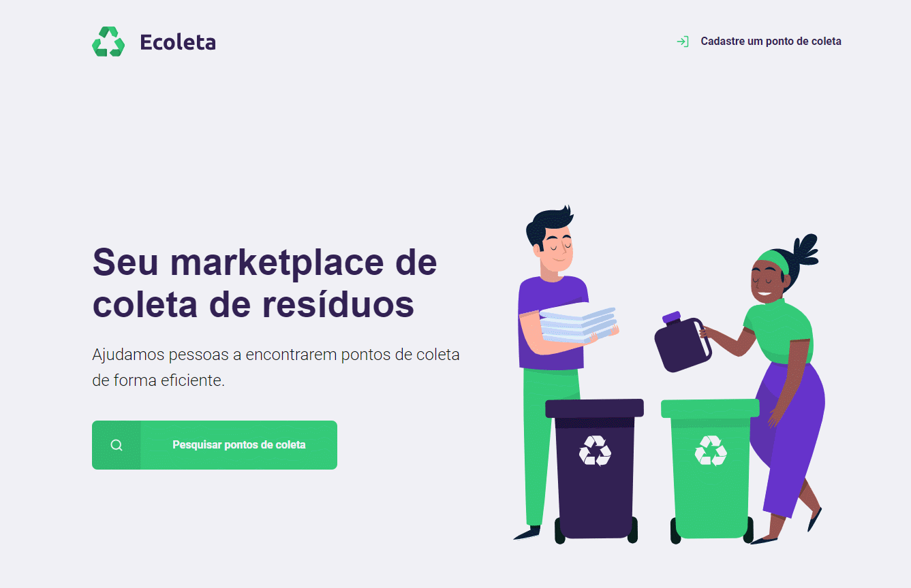

<h1 align="center">
    
</h1>

<h1>
    
</h1>

# Indice
- [Sobre](#-sobre)
- [Tecnologias Utilizadas](#-tecnologias-utilizadas)
- [Como baixar o projeto](#-como-baixar-o-projeto)
- [Licença](#-licença)

---

## 💡 Sobre
Desenvolvido na **Next Level Week** da Rocketseat, o projeto **Ecoleta** é uma plataforma que possibilita cadastrar e encontrar pontos de coleta reciclável na sua cidade.

---

## 🚀 Tecnologias utilizadas
O projeto foi desenvolvido utilizando as seguintes tecnologias:

- [Node](https://nodejs.org/en/) 12.18.0
- [Express](https://expressjs.com/pt-br/) 4.17.1
- [Nunjucks](https://mozilla.github.io/nunjucks/) 3.2.1
- [Sqlite3](https://www.sqlite.org/version3.html) 4.2.0

---

## 📥 Como baixar o projeto
```bash
# Clonar o repositório
git clone https://github.com/BrunoPiresDeOliveira/ecoleta.git

# Entrar no diretório
cd ecoleta

# Instalar as dependências
npm install

# Iniciar o server no http://localhost:3000
npm start
```

## 📝 Licença
[MIT License](/LICENSE)